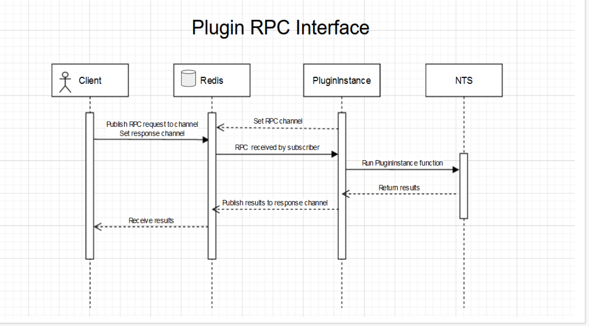

# Nanome Plugin Cookbook

Nanome is an immersive XR platform for collaborative computationally-driven molecular design. Learn more about Nanome at https://nanome.ai.


### Hello! Welcome to the Plugin Chef Cookbook. Here you can find all of the basic miniture code snippets to best cook up a Nanome plugin.

These how-tos are a supplement to the API documentation (https://nanome.readthedocs.io)

A new feature we're testing in this repo is communicating with a running PluginInstance via RPC requests using Redis Pub/Sub, which allows a user interact with their nanome session directly from the web browser (Desktop or VR).

## Installation

### Requirements:
- Docker (https://docs.docker.com/get-docker/)
- Docker Compose (https://docs.docker.com/compose/install/)

### Clone, Build,  and deploy
1) Use Git to clone this repository to your computer.
```sh
git clone https://github.com/nanome-ai/plugin-cookbook.git
````

2) Set up pre-commit hook to clear outputs before committing.
```sh
cp pre-commit-hook .git/hooks/pre-commit
chmod +x .git/hooks/pre-commit
```

3) Create .env file, and populate with NTS variables, and a strong token for your jupyter notebook
```sh
cp .env.sample .env
```

3) Build and deploy
```sh
./docker/build.sh
./docker/deploy.sh
```

## Using the cookbook
For now, the cookbook is expected to run on localhost.

- Once the plugin has been started, in the Nanome app you should see "Cookbook" in your Stacks Menu. Select it, and press Activate/Run

## Redis RPC architecture
- The application contains 2 docker containers deployed using docker-compose, `cookbook`, and `plugin_service`, which communicate via Redis Publish/Subscribe pattern.
- `plugin_service` container runs your standard plugin instance. When activated in Nanome, the plugin sets a Redis channel name, and opens your web browser to the cookbook. When the plugin is run, it subscribes to the Redis channel, and starts polling, waiting to receive messages containing info on what function to run.

- The `cookbook` container communicates with the plugin_service via the `PluginInstanceRedisInterface`, which resembles the standard PluginInstance class. But instead of communicating with NTS directly, it publishes messages to the set Redis channel that describe what function it wants the plugin instance to run. They message payload is a stringified json blob, where the function args and kwargs are pickled python objects. An example payload looks like:
```
{
  "function": <function_name>
  "args": [...],
  "kwargs": {...},
  "response_channel": "uuid4()"
}
```
- the response channel is subscribed to by `cookbook`, and it awaits the response data.
- When the message is received by `plugin_service`, it parses it and executes the provided function with args and kwargs. It then publishes the results back the `cookbook`, on the response channel.



## Contributors
@mjrosengrant
@ajm13
